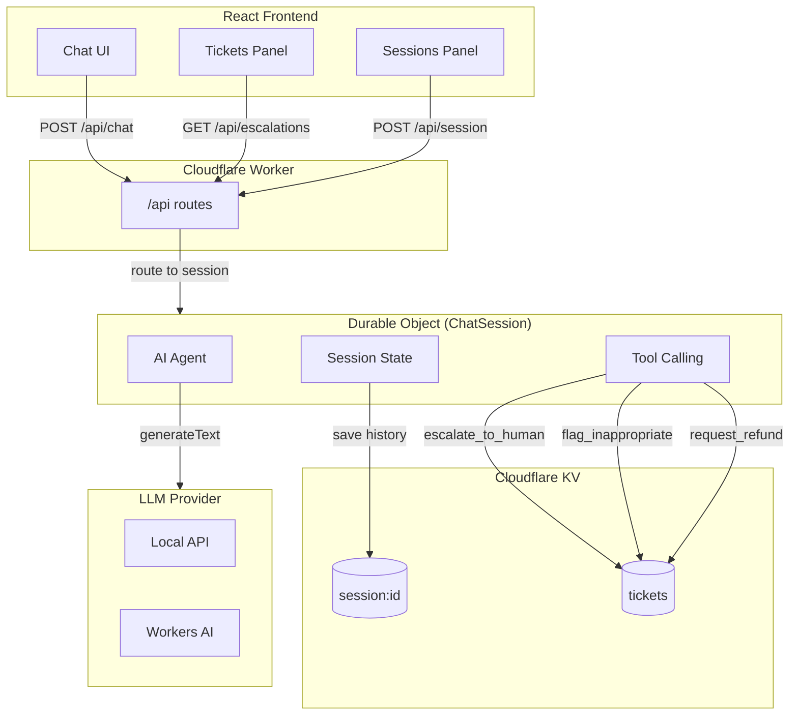

# Beacon

AI-powered customer support chat for Striker Elite soccer cleats. Built on Cloudflare Workers.

## What it does

Customers chat with an AI agent that can:
- Answer product questions
- Collect defect/damage reports and create escalation tickets
- Process refund requests
- Flag inappropriate behavior

The AI gathers all necessary info (order number, product details, damage description) before creating tickets for human review.

## Architecture



## Tech Stack

- **Frontend**: React, TypeScript, Vite, Tailwind
- **Backend**: Cloudflare Workers, Durable Objects, KV
- **AI**: Vercel AI SDK, Llama 3.3 (or any OpenAI-compatible API)

## Running locally

### 1. Install deps

```bash
cd worker && npm install
cd ../frontend && npm install
```

### 2. Configure LLM

Create `worker/.dev.vars`:

```
LOCAL_AI_BASE_URL=http://localhost:3030/v1
LOCAL_AI_API_KEY=your-key
LOCAL_AI_MODEL=your-model
CF_AI_MODEL=@cf/meta/llama-3.3-70b-instruct-fp8-fast
```

Set provider in `worker/wrangler.toml`:
```toml
[vars]
AI_PROVIDER = "local"  # or "cloudflare"
```

### 3. Start dev servers

```bash
# Terminal 1
cd worker && npm run dev

# Terminal 2
cd frontend && npm run dev
```

Open http://localhost:5173

## Testing

**Escalation flow:**
```
You: My cleats are broken, the sole is separating
Bot: [asks for order, product, size, damage location]
You: ORD-123, Striker Elite Pro, size 10, left heel
Bot: [creates ticket, closes conversation]
```

**Refund flow:**
```
You: I want a refund, studs broke off after one game
Bot: [gathers details, creates refund ticket]
```

**Inappropriate behavior:**
```
You: [profanity]
Bot: [flags immediately, closes conversation]
```

## Deploying

```bash
# Create KV namespace
wrangler kv:namespace create CHAT_KV
# Update wrangler.toml with the ID

# Set secrets
wrangler secret put LOCAL_AI_API_KEY

# Deploy
cd worker && npm run deploy
```

